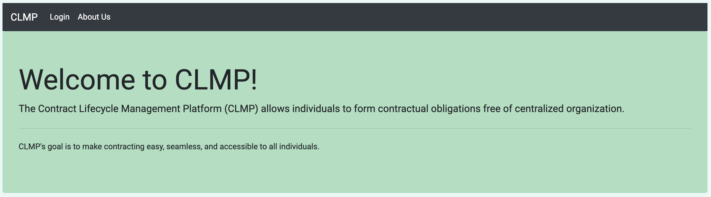

# Contract Lifecycle Management Platform (CLMP)
CLMP's goal is to make contracting easy, seamless, and accessible to all individuals.  

The idea of a social contract has been at the heart of society since the early formations of cities and governments.  Whether explicit or implicit, these agreements have formed the basis for modern political and economic development.  Technological advancements in computing power and resource access has created opportunities for more decentralized organizations, and has opened the door for an innovation in contractual agreements.

The deployed application can be viewed at [here](https://polar-eyrie-90569.herokuapp.com/).

## Motivation
CLMP is the chosen proposal from a selection of ideas for use as a means of applying the concepts learned in the East Carolina University (ECU) SENG 6240 *Software Architecture and Design* course, and was developed by the members of *Group 3* (listed below in the *Credits*).  

## Project Usefulness
CLMP helps users form contracts, accommodate review and approval of those contracts, and includes the addition of blockchain hashing.   

## Getting Started
* Start by cloning the repository to a local folder using the terminal command: `git clone https://github.com/wayfarer1549/ECU-SENG-6240-SP2020-Team-3-project.git`
* Navigate to the newly cloned directory and use the terminal command: `python manage.py runserver`

## Technology used
CLMP was developed using:
* Python and the [django](https://www.djangoproject.com) web framework
* Bootstrap, CSS, and Google Fonts for styling
* JavaScript
  
## Credits
CLMP was created by [Samuel Awosanya](https://github.com/sawosanya), [Kevin Boyle](https://github.com/kmboyle), Ibook Eyoita, [Scott Johnson](https://github.com/rscottjohnson), and [James Philips](https://github.com/wayfarer1549).
